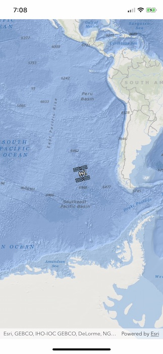

# Overview
A custom Location Data Source demo for the ArcGIS Runtime SDK for iOS, to track the International Space Station location in realtime.

This demo was built to accompany [this blog post](https://community.esri.com/community/developers/native-app-developers/arcgis-runtime-sdk-for-ios/blog/2019/05/08/runtime-location-part-1-the-blue-dot) (as well as [part 2](https://community.esri.com/community/developers/native-app-developers/arcgis-runtime-sdk-for-ios/blog/2019/05/09/runtime-location-part-2-location-data-sources) and [part 3](https://community.esri.com/community/developers/native-app-developers/arcgis-runtime-sdk-for-ios/blog/2019/05/09/runtime-location-part-3-a-custom-data-source) of the blog series).

## Features

* Show the current ISS location.
* Demonstrate creating a custom Location Data Source for use with the ArcGIS Runtime SDK for iOS.
* Customize the Current Location display.

## Requirements
* [ArcGIS Runtime SDK for iOS](https://developers.arcgis.com/en/ios/) 100.4 (or higher)
* Xcode 10.1 (or higher)

## Instructions

Open the project in Xcode and run.

## Additional Resources

* Location and the Runtime [blog post](https://community.esri.com/community/developers/native-app-developers/arcgis-runtime-sdk-for-ios/blog/2019/05/08/runtime-location-part-1-the-blue-dot).
* New to ArcGIS Runtime? Explore the documentation : [Guide](https://developers.arcgis.com/ios) | [API Reference](https://developers.arcgis.com/ios/latest/api-reference/), and check out the [Samples](https://github.com/Esri/arcgis-runtime-samples-ios)
* Got a question? Ask the community on our [forum](http://geonet.esri.com/community/developers/native-app-developers/arcgis-runtime-sdk-for-ios)

## Credits

* The superb ISS Icon was provided under Creative Commons 4.0 by https://goodstuffnononsense.com (see [iconarchive.com](http://www.iconarchive.com/show/free-space-icons-by-goodstuff-no-nonsense/international-space-station-icon.html))

## Issues

Find a bug or want to request a new feature?  Please let us know by submitting an issue.

## Contributing

Esri welcomes contributions from anyone and everyone. Please see our [guidelines for contributing](https://github.com/esri/contributing).

## Licensing
Copyright 2019 Esri

Licensed under the Apache License, Version 2.0 (the "License");
you may not use this file except in compliance with the License.
You may obtain a copy of the License at

   http://www.apache.org/licenses/LICENSE-2.0

Unless required by applicable law or agreed to in writing, software
distributed under the License is distributed on an "AS IS" BASIS,
WITHOUT WARRANTIES OR CONDITIONS OF ANY KIND, either express or implied.
See the License for the specific language governing permissions and
limitations under the License.

A copy of the license is available in the repository's [LICENSE]( /LICENSE) file.
